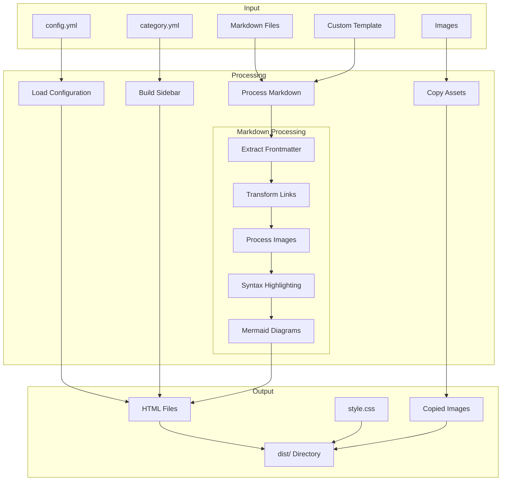

# Architecture

Documentinator follows a straightforward architecture for converting markdown documentation into a static HTML site. Here's a detailed breakdown of how it works:

## Overview

```mermaid
graph TD
    subgraph "Input"
        MD["Markdown Files"]
        IMG["Images"]
        CFG["config.yml"]
        CAT["category.yml"]
        TPL["Custom Template"]
    end

    subgraph "Processing"
        LOAD["Load Configuration"]
        SIDE["Build Sidebar"]
        PROC["Process Markdown"]
        COPY["Copy Assets"]

        subgraph "Markdown Processing"
            FRONT["Extract Frontmatter"]
            LINKS["Transform Links"]
            IMGS["Process Images"]
            CODE["Syntax Highlighting"]
            MERM["Mermaid Diagrams"]
        end
    end

    subgraph "Output"
        DIST["dist/ Directory"]
        HTML["HTML Files"]
        CSS["style.css"]
        IMGOUT["Copied Images"]
    end

    MD --> PROC
    IMG --> COPY
    CFG --> LOAD
    CAT --> SIDE
    TPL --> PROC

    PROC --> FRONT
    FRONT --> LINKS
    LINKS --> IMGS
    IMGS --> CODE
    CODE --> MERM

    LOAD --> HTML
    SIDE --> HTML
    MERM --> HTML
    COPY --> IMGOUT

    HTML --> DIST
    CSS --> DIST
    IMGOUT --> DIST
```
